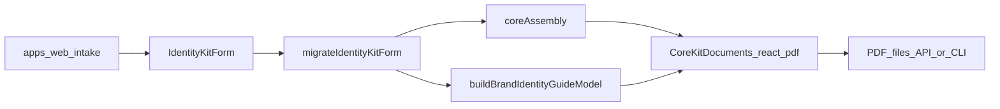

# Identity Kit — generation pipeline

How intake becomes PDFs: inputs, logic layers, outputs, and where to change behavior.

**Product context:** [PROJECT_OVERVIEW.md](./PROJECT_OVERVIEW.md)  
**Exhaustive rules:** [OUTPUT_TRANSLATION_SPEC.md](./OUTPUT_TRANSLATION_SPEC.md)  
**Per-PDF production spec:** [DELIVERABLE_PRODUCTION_SPEC.md](./DELIVERABLE_PRODUCTION_SPEC.md)

---

## End-to-end flow



1. **`apps/web`** collects `IdentityKitForm` via the micro-step wizard (`useFlowState` + `microStepSchema.ts`).  
2. **API or CLI** passes the form to `packages/generation`.  
3. **`migrateIdentityKitForm`** (`@identity-kit/shared`) normalizes schema version and backfills routing fields once.  
4. **Quick Start:** `quickStartBlocks` (+ `quickStartContent.ts` folio pointers) → `QuickStartDocument`. Refactor program: [`docs/audits/QUICK_START_REFACTOR.md`](docs/audits/QUICK_START_REFACTOR.md).  
5. **Brand Identity Guide:** `buildBrandIdentityGuideModel` → `BrandIdentityGuideDocument` (canonical reference; frozen six-page contract).  
6. **Deep dive PDFs:** `depthBriefBlocks`, `depthStyleGuideBlocks`, `depthVoicePlaybookBlocks` → Brief / Style / Voice documents (REF guide + GAP-only sections). Legacy `*Blocks` in `coreAssembly.ts` still feed the guide model and unit tests.  
7. **`renderToBuffer`** (`@react-pdf/renderer`) after `registerCoreKitPdfFonts()`.

Redundancy rules: [docs/product/DELIVERABLE_REDUNDANCY_MATRIX.md](./docs/product/DELIVERABLE_REDUNDANCY_MATRIX.md).

---

## Inputs

### Canonical payload: `IdentityKitForm`

Defined in [`packages/shared/src/form.ts`](./packages/shared/src/form.ts). Consumed by web, API, and generation.

### Intake schema versions

| Version | Meaning |
|---------|---------|
| **1** (implicit) | Legacy JSON without `businessOperatingModel` |
| **2** | Operating model enum shipped |
| **3** | Current; `guideFocus` backfilled on migration when missing |

Migration: [`packages/shared/src/intakeMigration.ts`](./packages/shared/src/intakeMigration.ts) — idempotent at `>= 3`.

Web defaults new forms to `intakeSchemaVersion: 3` in `useFlowState.ts`.

### Step fields (summary)

| Step | Fields (high level) |
|------|---------------------|
| **1** | `businessName`, `offer`, `transformation`, `industry`, `stage`, `brandNarrator`, `businessOperatingModel`, `touchpoints` (max 4, ordered), `primaryGoal`, `guideFocus` |
| **2** | `customerArchetype`; Pro: `painPoints`, `desiredOutcomes` |
| **3** | `tonePreset`, `voiceSliders`; Pro: `customVoiceNotes` |
| **4** | `values` (≥2); Pro: `missionStatement` |
| **5** | `originArchetype`; Pro: `originSummary`, `motivation` |
| **6** | `selectedPalette`, `selectedStyle`; Pro: `existingTypeface`, notes, `referenceUploadName` |
| **7** | `competitors`; Pro: `differentiation` |

**Core-visible vs Pro-only** detail: [OUTPUT_TRANSLATION_SPEC.md](./OUTPUT_TRANSLATION_SPEC.md) §2.1–§2.2.

### Micro-step wizard (UI source of truth)

Chapter/micro-step breakdown: [`apps/web/src/data/microStepSchema.ts`](./apps/web/src/data/microStepSchema.ts).

Validation rule refs: [`apps/web/src/validation/microStepValidation.ts`](./apps/web/src/validation/microStepValidation.ts).

Notable Step 1 gates:

| Micro-step | Required fields |
|------------|-----------------|
| `c1_s2` | `industry`, `stage`, `businessOperatingModel` |
| `c1_s4` | `touchpoints` (1–4), `primaryGoal`, `guideFocus` |
| `c1_s5` / `c1_s6` | Offer and transformation sentence slots |

Touchpoint IDs: [`packages/shared/src/touchpoints.ts`](./packages/shared/src/touchpoints.ts) — normalized before generation.

### `guideFocus` (routing signal)

Maps to `signals.emphasis` in the guide model (voice / visual / handoff / action). Drives editorial density, folio 04 bottom band, and related caps. See OUTPUT §10A.5.

---

## Logic: three layers

Framing from [docs/DETERMINISTIC_CUSTOMIZATION_MODEL.md](./docs/DETERMINISTIC_CUSTOMIZATION_MODEL.md):

| Layer | Responsibility | Primary modules |
|-------|----------------|-----------------|
| **1. Facts** | Normalize intake → profiles, clusters, labels | `brandProfile.ts`, touchpoint helpers, `intakeMigration` |
| **2. Section plans** | Route, caps, variant ids, omission | Path classes OUTPUT §3.3; guide `signals` in `brandIdentityGuideModel.ts` |
| **3. Copy** | Deterministic strings + PDF layout | `coreAssembly.ts`, `colorSummary.ts`, `personalityStoryQuote.ts`, `ctaSurfacePhrases.ts`, `CoreKitDocuments.tsx` |

### Legacy four PDFs

| PDF | Builder | Renderer |
|-----|---------|----------|
| Brand Brief | `brandBriefBlocks` | `BrandBriefDocument` |
| Style Guide | `styleGuideBlocks` | `StyleGuideDocument` |
| Voice Playbook | `voicePlaybookBlocks` | `VoicePlaybookDocument` |
| Quick Start | `quickStartBlocks` | `QuickStartDocument` |

Entry: `renderCoreKitPdfs(form)` → four buffers.

### Brand Identity Guide

| Stage | Module |
|-------|--------|
| Model | `buildBrandIdentityGuideModel(form)` in `brandIdentityGuideModel.ts` |
| PDF | `BrandIdentityGuideDocument` in `CoreKitDocuments.tsx` |
| CTA shells | `pdf/ctaFrames/*`, `pickPresentation.ts`, `ctaFolioTemplate.ts`, `slotClass.ts` |

Entry: `renderBrandIdentityGuidePdf(form)` → one buffer.

Folio 05 CTA copy: `composeCtaSurfaceBlocks` + `ctaSurfacePhrases.ts`. Layout budget: [docs/guides/CTA_IN_CONTEXT_FRAME_LIBRARY.md](./docs/guides/CTA_IN_CONTEXT_FRAME_LIBRARY.md).

### Path Class Catalog

Canonical Core routing combinations: [OUTPUT_TRANSLATION_SPEC.md](./OUTPUT_TRANSLATION_SPEC.md) **§3.3** and **§3.3.1**. Update spec + `core-pdfs.test.ts` when routing changes.

---

## Outputs

### Files (Core, today)

| File | API id | Renderer |
|------|--------|----------|
| `01-brand-brief.pdf` | `brandBrief` | `renderCoreKitPdfs` |
| `02-style-guide.pdf` | `styleGuide` | `renderCoreKitPdfs` |
| `03-voice-playbook.pdf` | `voicePlaybook` | `renderCoreKitPdfs` |
| `04-quick-start.pdf` | `quickStart` | `renderCoreKitPdfs` |
| `05-brand-identity-guide.pdf` | `brandIdentityGuide` | `renderBrandIdentityGuidePdf` |

API: `POST /generate/core` body `{ form }` — see [`apps/api/src/index.ts`](./apps/api/src/index.ts).  
Downloads: `GET /generated/:sessionId/:fileName`.

CLI: `npm run generate:pdfs -- [persona]` → `packages/generation/output/<persona>/`.

Persona fixtures: `packages/generation/src/fixtures/personas/` (e.g. `established-pro` for Sterling Compliance Advisors).

### Brand Identity Guide — reader IA

Five **nav** sections; **six** physical pages. Spread **titles** may differ from nav labels. PDF **decks** (`editorial.deck`) are kept on the model for tests but **not rendered** under folio titles on the guide PDF.

| Physical page | Folio | Nav | Spread title | Key blocks |
|---------------|-------|-----|--------------|------------|
| 1 | 01 | Summary | Business name (hero) | Radial quote (`oneLine`), Core values, What we do / Who it's for / What changes |
| 2 | 02a | Look | Your colors | Color summary, Visual keywords, flush swatch row |
| 3 | 02b | Look | Your typography | Typeface specimens, wordmark rail + font links, 2×2 name-in-palette grid |
| 4 | 03 | Personality | How your brand should come across | Brand heart (Feel / Vision·Mission·Promise or stands-for), gradient quote, Brand behavior, trust cue |
| 5 | 04 | Voice | How your brand sounds | Traits, Rules, What to talk about, Do/avoid, sample lines + transmutation arc, bottom band |
| 6 | 05 | Examples | Your brand voice in use | Sample lines row, CTA band (in-context shells or templates), before/after |

**Chrome accents:** micro-glyphs on select folios (see `MicroGlyph.tsx`, `glyphTokens.ts`, tests in `core-pdfs.test.ts`).

Folio detail: [docs/audits/BRAND_IDENTITY_GUIDE_REFACTOR_STATUS.md](./docs/audits/BRAND_IDENTITY_GUIDE_REFACTOR_STATUS.md).

---

## QA contract

```bash
npm run test:generation   # packages/generation — core-pdfs.test.ts
npm run generate:pdfs -- established-pro   # write PDFs for visual review
```

Pinned behaviors include:

- Brand Identity Guide **page count = 6** for canonical personas.  
- Reader-visible copy walker (banned vocabulary, em-dash budget, etc.) — see OUTPUT §1.0.1.  
- Folio layout regression tests in `core-pdfs.test.ts`.

After schema or generation changes, prefer `npm run dev:api:built` when testing web → API generate.

---

## Dev workflows

| Task | Command |
|------|---------|
| Web only | `npm run dev:web` |
| API + web (generate) | `npm run dev:api:built` and `npm run dev:web` (separate terminals) |
| CTA frame preview (local) | `npm run dev:cta-frames` |
| Regenerate symbol strip | `npm run generate:brand-strip` |

More: [PDF_GENERATION.md](./PDF_GENERATION.md).

---

## Pro AI layer (Pro-A — in progress)

Pro fulfillment adds `packages/generation/src/ai/` on top of the deterministic compiler. Contract: [`docs/research/AI_INTEGRATION_PLAYBOOK.md`](./docs/research/AI_INTEGRATION_PLAYBOOK.md).

| Piece | Path |
|-------|------|
| Anthropic adapter | `src/ai/client.ts` — `callClaude`, call-class defaults, prompt caching |
| Intake → prompt blocks | `src/ai/prompts/buildPromptContext.ts`, `buildSystemPrompt.ts` |
| Scaffold-and-refine | `src/ai/dispatcher.ts` |
| First `ai_enhanced` section | `src/ai/sections/briefIdealCustomer.ts` — `rewriteBriefIdealCustomer` |
| Pro PDF override hook | `src/pro/buildProEnhancements.ts`, `depthBriefBlocks(..., proOverrides)` |
| Ideal customer spec | [`docs/specs/BRIEF_IDEAL_CUSTOMER.md`](./docs/specs/BRIEF_IDEAL_CUSTOMER.md) — structured snapshot, not narrative |
| Ideal customer audience research (proposed) | [`docs/research/BRIEF_IDEAL_CUSTOMER_AUDIENCE_RESEARCH.md`](./docs/research/BRIEF_IDEAL_CUSTOMER_AUDIENCE_RESEARCH.md) — blurb + five bank-backed slots; not implemented |
| Pro PDF CLI | `npm run generate:pro-pdfs -- text\|vision` → `output/pro-smoke-<id>/` |
| Shared output schemas | `packages/shared/src/ai/schemas/` |

**Tests & preview**

```bash
npm run test:generation       # unit tests only — no Anthropic credits
npm run test:pro-smoke          # 2 live Sonnet smoke calls (text + vision)
npm run generate:pro-pdfs -- text   # 5 Pro PDFs; 1 Sonnet call for Brief Ideal customer (skip with --no-ai)
```

Set `ANTHROPIC_API_KEY` in repo-root `.env`. Pro smoke fixtures: `fixtures/pro-smoke/` (not `established-pro`, which is Core-only).

---

## Where to change what

| Change | Start here |
|--------|------------|
| New intake field | `form.ts`, `microStepSchema.ts`, `microStepValidation.ts`, OUTPUT §2, migration if needed |
| Core path / routing | OUTPUT §3.3, `brandProfile.ts`, `coreAssembly.ts`, tests |
| Guide folio copy/layout | `brandIdentityGuideModel.ts`, `CoreKitDocuments.tsx`, OUTPUT §10A, refactor status doc |
| Folio 05 CTA shell geometry | `pdf/ctaFrames/`, CTA frame library guide |
| Before / after rewrites (Voice + guide folio 05 rail) | `phase8Content.ts`, `brandIdentityGuideModel.ts` (`isQualifyingBeforeAfterPair`); discovery: [`docs/research/BEFORE_AFTER_COPY_DISCOVERY.md`](./docs/research/BEFORE_AFTER_COPY_DISCOVERY.md) |
| Pro AI call / prompt context | `packages/generation/src/ai/`, playbook §12, [`INTAKE_CONTRACT.md`](./docs/audits/INTAKE_CONTRACT.md) |
