# Before / After Copy — Discovery & Quality Path

**Status:** discovery doc (issues identified; high-quality final output not yet built).  
**Scope:** Core deterministic **Before / after** pairs on Voice Playbook and Brand Identity Guide folio 05 (editorial rail).  
**Out of scope here:** Pro-only AI before/after on Voice page 3 (see [`AI_INTEGRATION_PLAYBOOK.md`](./AI_INTEGRATION_PLAYBOOK.md) §12.9) — separate delivery track, same quality bar at ship time.

This document does **not** contain example copy. It records **known gaps**, **how the system works today**, and a **sequenced path** for discovery, routing logic, and (optionally) a prescriptive bank—mirroring the discipline applied to folio 05 CTAs without duplicating that work.

---

## 1. Why this doc exists

Folio 05 pairs **in-context CTA shells** (prescriptive bank, surface-aware) with **before/after rewrites** in a narrow rail. Review feedback: rewrites often read **too long** and **not native to the platform** beside the shells. CTAs were improved via waves A–G and [`CTA_COPY_RULES.md`](../../packages/generation/dev/cta-phrase-banks/CTA_COPY_RULES.md); before/after still uses **procedural templates** in [`phase8Content.ts`](../../packages/generation/src/deterministic/phase8Content.ts). This doc is the charter for closing that gap.

---

## 2. Authoritative references

| Topic | Document / code |
|--------|------------------|
| Product intent (2 pairs, weak→strong, routing) | [`DELIVERABLE_PRODUCTION_SPEC.md`](../../DELIVERABLE_PRODUCTION_SPEC.md) — Before / after examples (Core) |
| Rubric, trim order, signal hooks | [`OUTPUT_TRANSLATION_SPEC.md`](../../OUTPUT_TRANSLATION_SPEC.md) §10A.6, §10A.8 |
| Path-class expectations | [`OUTPUT_TRANSLATION_SPEC.md`](../../OUTPUT_TRANSLATION_SPEC.md) §3.3.1 (add-on: `local_team` before/after labels) |
| Implementation | [`phase8Content.ts`](../../packages/generation/src/deterministic/phase8Content.ts) — `buildBeforeAfterPairs`, `voicePlaybookBeforeAfterBody` |
| Qualifying filter (guide only) | [`brandIdentityGuideModel.ts`](../../packages/generation/src/deterministic/brandIdentityGuideModel.ts) — `isQualifyingBeforeAfterPair`, `parseBeforeAfter`, caps |
| PDF rail layout | [`CoreKitDocuments.tsx`](../../packages/generation/src/pdf/CoreKitDocuments.tsx) — `GuideBeforeAfterPanel` (`railSkinnyColumn` when CTAs present) |
| Tests (routing + anti-patterns) | [`core-pdfs.test.ts`](../../packages/generation/src/core-pdfs.test.ts) — Voice Playbook / before-after describe blocks |
| CTA quality program (parallel, not substitute) | [`CTA_BANK_AUDIT.md`](./CTA_BANK_AUDIT.md), [`CTA_COPY_RULES.md`](../../packages/generation/dev/cta-phrase-banks/CTA_COPY_RULES.md) |

---

## 3. Current pipeline (as built)

```mermaid
flowchart LR
  intake[Step1 narrator touchpoints goal industry offer transformation]
  ctx[buildRewriteContext]
  pick[pickBeforeAfterScenarios - 2 of 6 scenarios]
  tpl[beforeForScenario / afterForScenario templates]
  vp[voicePlaybookBeforeAfterBody]
  parse[parseBeforeAfter]
  rubric[isQualifyingBeforeAfterPair]
  cap[maxBeforeAfterPairs slice]
  pdf[Voice Playbook + Guide folio 05 rail]

  intake --> ctx --> pick --> tpl --> vp --> parse --> rubric --> cap --> pdf
```

**Scenario types today (internal labels):** social hook, visit or listing, service intro, profile or bio, product or listing proof, mission invitation.

**Signals that actually change output:**

- `brandNarrator` + `touchpointCluster` (from `brandProfile.ts`) → which two scenarios fire  
- `tonePreset` + `voiceSliders.directness` → punchier vs softer template branches  
- `primaryGoal` → goal tail on some scenarios (not all)  
- `touchpoints[0]` → channel name in profile/bio scenario only  
- Industry `preferredTerms` (two terms) → proof tokens in several after-templates  
- Transformation ids → benefit clause via substring matching on after-state labels  

**Signals that do not change output enough today:**

- Second and third touchpoints (e.g. Instagram + Facebook) — no per-surface pair or label  
- Selected CTA surface families on folio 05 — no alignment between shell type and rewrite scenario  
- `contentDensityBias` — only **count** of pairs (1 vs 2), not copy shape  

---

## 4. Product intent vs shipped behavior

| Intent (spec / deliverable) | Shipped today | Gap |
|-----------------------------|---------------|-----|
| Teach one **reusable copy pattern** per pair | Rubric checks length, label non-generic, edit distance | No check that pattern matches **channel format** |
| Channel-relevant **labels** (§10A.8) | Scenario-type labels (*Social hook rewrite*, etc.) | Reader does not see *where* to paste |
| One discovery-style + one conversion-style rewrite | Scenario routing by narrator/cluster | **Social hook** after-path reuses **brand-promise** assembly, not hook-shaped copy |
| Plain, specific, trust-building | Industry terms + business name injected | Template seams (*people can trust*, goal tails on bio-shaped lines) |
| Complements folio 05 CTAs | Same page, no dedupe | Risk of **tone/length mismatch** next to short paste-ready CTAs |
| Core deterministic quality | Unit tests for routing and banned phrases | **No** prescriptive bank or copywriter sign-off pass |

**Pro boundary:** Richer pairs are specified as **Pro AI** on Voice page 3. Core must still meet a clear floor on the guide rail because buyers see it in the **primary** PDF.

---

## 5. Known issues (no example strings)

### 5.1 Architecture

1. **Procedural assembly, not a bank** — Unlike CTAs, there is no reviewed leaf matrix (surface × scenario × industry × tone). Quality is bounded by template design and tests, not tuple inventory.  
2. **Single source, dual surface** — Voice Playbook body and guide rail share the same strings; rail width constraints are not modeled in generation.  
3. **No dedupe** — Before/after lines are not checked against `samplePhrases`, `ctaTemplates`, or rendered `ctaSurfaces` on folio 05.

### 5.2 Scenario / platform fit

4. **Social hook ≠ hook** — The social-hook scenario’s “after” path is tied to the same transformation/offering sentence machinery used for brand promise lines, producing **multi-clause brand copy** where a **short, channel-native opener** is expected.  
5. **Weak touchpoint binding** — Only the first touchpoint id affects one scenario; multi-touchpoint kits do not get per-channel pairs or labels.  
6. **Scenario labels ≠ placement labels** — Labels describe rewrite *type*, not *placement* (feed caption, story overlay, listing intro, bio line, etc.).  
7. **Goal tails on wrong shapes** — Generic goal closers can append to bio- or invite-shaped templates, feeling like a CTA bolted onto non-CTA copy.

### 5.3 Length & layout

8. **No max length / word budget** — Qualifying rubric minimum is **12 characters**; there is no maximum. Long “after” lines stress `railSkinnyColumn` on folio 05.  
9. **No scenario-specific length policy** — Hook, listing, and bio scenarios share the same structural limits.

### 5.4 Rubric & spec alignment

10. **§10A.8 channel labels not implemented** — Spec asks for placement vocabulary; code enforces anti-generic labels only.  
11. **Rubric is structural, not editorial** — Pass/fail does not assess naturalness, platform register, or “would a founder paste this.”  
12. **Benefit clause routing** — Transformation “after” state is interpreted via **substring heuristics** on catalog labels; edge labels may map to generic benefit fallbacks.

### 5.5 vs CTA program

13. **Different quality investment** — CTAs: prescriptive bank, waves, audit, intentional gaps, folio routing. Before/after: MVP templates + routing tests.  
14. **No `BEFORE_AFTER_COPY_RULES`** — Nothing equivalent to CTA §13 four-question read-aloud charter for this artifact.

---

## 6. Target quality bar (definition of “done” for Core)

When discovery and implementation are complete, each shipped pair should satisfy **all** of:

| # | Criterion | How to verify |
|---|-----------|----------------|
| **B1** | **Placement-clear label** — Reader knows where to use the line (aligned with touchpoints or folio 05 shells). | Snapshot tests + manual folio 05 skim per `PC-*` fixture |
| **B2** | **Format-appropriate length** — Hook/caption scenarios within agreed word caps; listing/bio scenarios may be longer but bounded. | Linter or test on word count per scenario class |
| **B3** | **True weak→strong rewrite** — Before is generic; after is on-brand, not a synonym swap (existing edit-distance rule retained). | `isQualifyingBeforeAfterPair` + editorial review |
| **B4** | **Platform register** — Copy shape matches scenario (hook vs bio vs listing), not website paragraph tone beside IG/FB shells. | Read-aloud against rules doc (§7 below) |
| **B5** | **Consistent with voice system** — Uses tone, narrator, and industry vocabulary without meta-commentary (existing bans retained). | Banned-pattern tests + rules doc |
| **B6** | **Complements CTAs** — Does not duplicate folio 05 paste lines; teaches a different job (voice rewrite vs action ask). | Dedupe test against normalized CTA + sample strings |
| **B7** | **Rail-safe** — Fits folio 05 skinny column without feeling truncated (design review). | PDF visual QA on `coffee-founder` + 2 other personas |

Pro Voice page 3 AI pairs should meet **B1–B7** at generation time via prompt contract; Core meets them deterministically.

---

## 7. Proposed normative rules doc (future)

Create [`packages/generation/dev/before-after/BEFORE_AFTER_COPY_RULES.md`](../../packages/generation/dev/before-after/BEFORE_AFTER_COPY_RULES.md) (path TBD) **after** discovery phase D2, modeled on `CTA_COPY_RULES.md`:

- Scenario definitions (what “hook” vs “listing” vs “bio” mean in **word count** and **rhetorical job**)  
- Placement label vocabulary tied to touchpoint buckets  
- Banned patterns (meta-voice, consultant-speak, duplicate CTA function)  
- Read-aloud checklist (four questions, no pasted examples in the rules file—examples live in bank or fixtures only)  
- Relationship to transformation intake (when to reference promise vs when to stay channel-local)

Do not author this file until D2 inventory is complete—otherwise rules will codify today’s templates.

---

## 8. Discovery phases

### D1 — Inventory & benchmark (read-only)

**Goal:** Map what ships today without changing code.

| Task | Output |
|------|--------|
| Export before/after pairs for all `PC-*` personas + `coffee-founder`, `cta-mixed`, `lean-core` | Spreadsheet or markdown table: scenario label, char count, word count, touchpoints, goal, narrator |
| Side-by-side folio 05 PDF skim | Notes: rail overflow, tone mismatch vs left-column shells |
| Compare to Voice Playbook page 3 spec (Pro) | List what Core must not defer to AI |
| Read §10A.8 vs `phase8Content` labels | Written gap list (feeds §5) |

**Exit:** Signed-off “as-is” matrix; no copywriting yet.

### D2 — Scenario & placement taxonomy

**Goal:** Agree on **what kinds of pairs** the product needs—not the sentences.

| Task | Output |
|------|--------|
| Define placement types (e.g. short social opener, listing lede, bio line, visit invitation, service intro) | Taxonomy doc section in rules file |
| Map placement types → touchpoint clusters + narrator (not 1:1 with today’s six scenarios) | Routing matrix draft |
| Decide label strategy: **placement-first** vs **scenario-first** for reader | Decision locked in OUTPUT §10A.8 |
| Set word-count bands per placement type | Numeric budgets for B2 |

**Exit:** Routing matrix approved; rules doc outline approved.

### D3 — Logic & routing design

**Goal:** Specify **deterministic selection** before any bank merge.

| Task | Output |
|------|--------|
| Multi-touchpoint kits: one pair per selected surface vs two generic pairs | Product decision + spec update |
| Align pair selection with folio 05 `ctaSurfaces` when present (same channels, different job than CTA) | Design note in OUTPUT §10A.8 / §10A.6A |
| Split **social hook** generation from **transformation promise** assembly | Engineering ticket: new after-path or scenario rename |
| `goalActionTail` policy: which placements get a closer | Decision table |
| Dedupe policy vs samples + CTAs | Normalization rules (mirror CTA dedupe) |
| Density: still 1–2 pairs or 2–3 when rail + three CTA modules | Layout constraint from CTA frame playbook |

**Exit:** ADR or spec patch; implementation tasks filed.

### D4 — Content strategy fork (choose one or hybrid)

| Track | Description | When to prefer |
|-------|-------------|----------------|
| **L — Logic-only templates** | Improve `phase8Content` with placement-aware, length-capped templates | Fast MVP lift; acceptable if D2 matrix is small |
| **B — Prescriptive bank** | `BEFORE_AFTER_PHRASE_BANKS.md` → codegen, analogous to CTAs | Parity with CTA quality program; more copywriter time |
| **H — Hybrid** | Bank for high-traffic placements; templates for long tail | Matches tiered CTA depth strategy |

**Exit:** Track(s) chosen; copywriter scope estimate (leaf count), if B or H.

### D5 — Implementation & QA gate

| Task | Output |
|------|--------|
| Implement routing + content per D3/D4 | Code + optional bank gen script |
| Extend `core-pdfs.test.ts`: word caps, placement labels, dedupe, PC-* snapshots | CI gate |
| Visual QA: folio 05 six-page contract preserved | Green page-count tests |
| Read-aloud sign-off per industry group (mirror CTA §7) | Checklist signed |

**Exit:** B1–B7 satisfied for Core; roadmap item closed.

---

## 9. Logic work backlog (engineering, pre-bank)

These are **discovery and routing** items; order follows D3.

1. **Decouple social-hook “after” from transformation promise builder** — New assembly path with hook-length policy.  
2. **Placement-first labels** — Derive from touchpoint definitions / folio 05 surface labels, not internal scenario enum names.  
3. **Touchpoint-aware pair selection** — Use ordered touchpoints (and surface families), not only `touchpoints[0]`.  
4. **Scenario-specific max words** — Enforced in generator and in `isQualifyingBeforeAfterPair` (or a dedicated validator).  
5. **Folio 05 dedupe** — Normalize and reject pairs that collide with sample phrases or rendered CTA lines.  
6. **Optional: folio layout hook** — Pass `hasExamplesCtaContent` / rail variant into generator to tighten caps when `railSkinnyColumn` is active.  
7. **Align spec §10A.8 with implementation** — Update OUTPUT after D2 decisions (labels, signal hooks, trim order).

---

## 10. Content work backlog (copywriter, post-D4)

Only if track **B** or **H** is selected:

1. Leaf inventory: `(placement type × industry group × tone × narrator)` with tiered depth targets (reuse CTA tiering idea).  
2. Author **weak before** lines (generic) and **strong after** lines (on-brand) per leaf—stored in bank markdown, not in this discovery doc.  
3. Wire `gen-before-after-banks.mjs` (or extend existing tooling) into generation.  
4. Pro AI prompt anchors: use Core deterministic pair as scaffold reference per [`AI_INTEGRATION_PLAYBOOK.md`](./AI_INTEGRATION_PLAYBOOK.md).

If track **L** only: copywriter reviews template **shapes** and constraint tables, not thousands of leaves.

---

## 11. Test & fixture extensions (planned)

| Test | Purpose |
|------|---------|
| Per-`PC-*` before/after snapshot | Lock routing + labels + word counts |
| Word-count ceiling per scenario/placement | Enforce B2 |
| Dedupe vs `examples.samplePhrases` + CTA surfaces | Enforce B6 |
| Rail persona regression (`coffee-founder`, `cta-mixed`) | B7 layout + 6-page guard |

Existing tests remain: meta-commentary ban, compliance path, narrator routing, distinct before lines.

---

## 12. Sequencing relative to other work

| Dependency | Note |
|------------|------|
| Folio 05 CTA bank / waves | **Parallel** — do not block CTA merge; before/after is independent pipeline |
| CTA frame layout | Rail width is fixed; length policy must respect current playbook |
| Pro-0 AI Voice page 3 | Core floor (B1–B7) should be set **before** Pro AI rewrites ship, or Pro will inherit weak anchors |
| `PHASE_ROADMAP` output value audit | Before/after is part of “raise consultative floor” on Examples, distinct from Brief blocks |

**Suggested order:** D1 → D2 → D3 → (L or B/H) → D5. D1 can start immediately without code changes.

---

## 13. Open decisions (log here)

| ID | Question | Status |
|----|----------|--------|
| O1 | Placement-first labels vs keep scenario labels with dek? | Open |
| O2 | One pair per touchpoint vs two pairs per kit cap? | Open |
| O3 | Logic-only vs prescriptive bank vs hybrid? | Open |
| O4 | Should social-hook pair reference the same channel as first folio 05 social shell? | Open |
| O5 | Pro AI replaces Core rail copy or only augments Voice PDF page 3? | Open (spec says Pro page 3; guide rail is Core today) |

---

## 14. Changelog

| Date | Change |
|------|--------|
| 2026-05-27 | Initial discovery doc: issues, quality bar, phased path (no example copy). |
