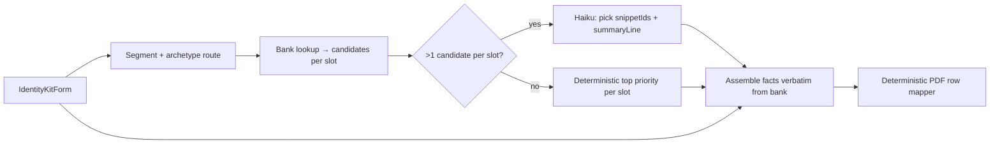

# Brand Brief — Ideal customer audience research enrichment (design memo)

**Status:** **Proposed — not implemented.** Captures product, schema, cost, and ops design from May 2026 planning. Current shipped behavior remains [`docs/specs/BRIEF_IDEAL_CUSTOMER.md`](../specs/BRIEF_IDEAL_CUSTOMER.md) (Pro-A v1: `summaryLine` + traits + caresAbout).

**Date:** 2026-05-28  
**Audience:** Pro-A follow-up, intake design, ops  
**Related:**

- [`docs/specs/BRIEF_IDEAL_CUSTOMER.md`](../specs/BRIEF_IDEAL_CUSTOMER.md) — current v1 section contract
- [`docs/audits/PRO_KIT_STRATEGY.md`](../audits/PRO_KIT_STRATEGY.md) §1.4 (cost envelope), §8 (AI architecture)
- [`docs/research/AI_INTEGRATION_PLAYBOOK.md`](./AI_INTEGRATION_PLAYBOOK.md) — per-call adapter, walkers, prompt caching
- [`docs/audits/INTAKE_CONTRACT.md`](../audits/INTAKE_CONTRACT.md) — Step 2 audience fields
- [`docs/audits/QUICK_START_CHANNEL_MATRIX.md`](../audits/QUICK_START_CHANNEL_MATRIX.md) — precedent for curated SMB stats + named sources

---

## 1. Executive summary

**Problem:** Pro `brief.idealCustomer` today rewrites intake (archetype card + optional pain/outcomes). Without external grounding it can read as “better phrasing of what you told us,” not lightweight strategist desk research.

**Proposal:** Add a **persona-card layout** to the Brand Brief Ideal customer section:

1. One **blurb** sentence (who they serve — intake-grounded, optionally AI-written).
2. **Five fixed fact slots** below it (age range, income, buying behavior, etc.) filled from a **curated research bank**, not model invention.
3. **Deterministic PDF rendering** — slot labels and row layout are code-owned; zero AI spent on formatting.
4. **Optional Haiku call** only to pick which pre-vetted snippets apply + write the blurb when candidate sets are ambiguous.
5. **Quarterly source monitoring** — automated change detection on 10–15 trusted sources; **human approval** before any stat updates ship.

**Cost target:** ~$0.01–0.05 incremental per kit (vs ~$3–4 total Anthropic budget in §1.4). Margin impact negligible; differentiation impact high.

**Scope boundary:** This stays a **scannable snapshot** in the Brand Brief. Buying triggers, objections, resonant language, and behavioral essays remain **Strategy Memo §3** (Opus, Pro-E).

---

## 2. Product intent

### 2.1 What a lightweight agency pass looks like

| Agency step | Identity Kit today | This proposal |
|-------------|-------------------|---------------|
| Segment definition | `customerArchetype` + industry | Unchanged + optional `step2.audienceNotes` (future intake) |
| Buyer voice / pains | `painPoints`, `desiredOutcomes` | Blurb + intake-backed slots when bank is thin |
| Desk research (3–5 directional facts) | None | Five slot values from research bank |
| Persona narrative | Strategy Memo §3 | Explicitly out of scope here |

### 2.2 Buyer-facing layout (Brand Brief PDF)

The Ideal customer block renders as labeled key–value rows (same pattern as Brand overview / Differentiation in `BriefStructuredBlock`). Proposed structure:

```
[BLURB — one sentence, bold row]

TYPICAL AGE RANGE          … (2024)
HOUSEHOLD INCOME           … (2024)   ← labels vary by segment profile
HOW THEY BUY               … (2024)
EDUCATION                  … (2024)
MINDSET                    … (2024)

Market context is directional industry research — not a census of your customers.
```

**Source attribution:** Default to a **single block footnote** (cleaner scan). Per-row attribution is optional if design review prefers higher credibility density. All snippets retain `snippetId` + `sourceId` in persisted JSON for support and audit.

### 2.3 What we will not do (v1 of this enhancement)

- Live web search or LLM browsing per kit at fulfillment time
- Auto-update production snippet text without human review
- Precise census claims unless a snippet is explicitly tagged `framing: 'exact'` (default: `directional`)
- Duplicate Strategy Memo §3 behavioral depth

---

## 3. Output schema (proposed)

Replaces or extends the current v1 schema when implemented. Labels are **not** model-generated — only `value` text comes from the bank (verbatim) or intake (explicit fallback slots).

```ts
type AudienceFactSlot =
  | 'age_range'
  | 'household_income'
  | 'education_level'
  | 'buying_behavior'
  | 'psychographic'
  | 'decision_role'        // B2B substitute for age_range
  | 'organization_size'    // B2B substitute for household_income

type AudienceFact = {
  slot: AudienceFactSlot
  value: string           // max ~80 chars; copied from bank or intake
  snippetId?: string      // required when research-backed
  sourceId?: string       // denormalized from bank for audit
  asOf: string            // e.g. "2024" — from bank, never from model
  framing: 'directional' | 'intake' | 'exact'
}

type BriefIdealCustomerAudienceResearch = {
  summaryLine: string     // 1 sentence blurb
  facts: AudienceFact[]   // exactly 5; unique slots per segment profile
  fieldsCited: string[]   // intake fields only
}
```

### 3.1 Fixed slot labels (code-owned)

```ts
const SLOT_LABELS: Record<AudienceFactSlot, string> = {
  age_range: 'TYPICAL AGE RANGE',
  household_income: 'HOUSEHOLD INCOME (DIRECTIONAL)',
  education_level: 'EDUCATION',
  buying_behavior: 'HOW THEY BUY',
  psychographic: 'MINDSET',
  decision_role: 'DECISION-MAKER',
  organization_size: 'ORGANIZATION SIZE',
}
```

PDF rows = `summaryLine` (bold) + five `{ label: SLOT_LABELS[slot], value }` rows. **No string parsing** of prose into layout (today Pro injects `briefIdealCustomerBody` text; this design prefers structured `ProSectionOverrides` or a typed row list).

### 3.2 Segment slot profiles

Always **five rows**, but slot **types** change by Quick Start–style segment route (S1–S6). Examples:

| Segment | Slot 1 | Slot 2 | Slot 3 | Slot 4 | Slot 5 |
|---------|--------|--------|--------|--------|--------|
| S1 / S6 (consumer-facing) | `age_range` | `household_income` | `buying_behavior` | `education_level` | `psychographic` |
| S2 (professional services) | `decision_role` | `organization_size` | `buying_behavior` | `education_level` | `psychographic` |
| S4 (trades / home services) | `age_range` | `household_income` | `buying_behavior` | `education_level` | `psychographic` |

Segment resolution reuses existing intake signals (`step1.industry`, `businessOperatingModel`, touchpoint cluster) — same routing family as [`QUICK_START_CHANNEL_MATRIX.md`](../audits/QUICK_START_CHANNEL_MATRIX.md).

Optional `customerArchetype` filter narrows snippet candidates within a segment.

---

## 4. Research bank

### 4.1 Two-layer data model

**Layer A — Trusted sources** (10–15 to seed):

```ts
type TrustedSource = {
  id: string                 // e.g. 'pew_mobile_shopping_2024'
  url: string
  publisher: string          // e.g. 'Pew Research Center'
  title: string
  checkCadence: 'quarterly'
  lastCheckedAt: string      // ISO date
  contentHash: string        // sha256 of extracted excerpt region
  extractHint?: string       // optional: human note for refresh script
}
```

**Layer B — Audience snippets** (~30–50 at v1, not thousands):

```ts
type AudienceSnippet = {
  id: string
  sourceId: string           // FK → TrustedSource
  segments: string[]         // S1…S6
  slots: AudienceFactSlot[]
  archetypes?: string[]      // optional filter on customerArchetype id
  value: string              // ≤80 chars, buyer-facing
  framing: 'directional' | 'exact'
  asOf: string
  priority: number           // tie-break when multiple match
}
```

Snippets are **pre-written by humans** from source material. Fulfillment copies `value` verbatim — models select `snippetId`, they do not paraphrase stats.

### 4.2 Seeding strategy

- Start with **10–15 primary sources** (Census ACS, BLS consumer expenditure, Pew, relevant industry bodies, SMB surveys already cited in internal docs where quality allows).
- Target **3–5 snippets per source** where segment coverage overlaps.
- Reuse research investment across Quick Start channel matrix, Brief Ideal customer, and (later) Memo proof-point suggestions — one corpus, multiple consumers.

### 4.3 Intake complement (optional Phase 1)

Add Pro-only optional field `step2.audienceNotes` (2–4 sentences). Feeds blurb + can fill a slot tagged `framing: 'intake'` when bank coverage is thin. Document in [`INTAKE_CONTRACT.md`](../audits/INTAKE_CONTRACT.md) when scheduled.

---

## 5. Fulfillment pipeline (proposed)



### 5.1 Call economics

| Step | Model | Cost / kit | Notes |
|------|-------|------------|-------|
| Bank lookup | — | $0 | Deterministic |
| Snippet pick + blurb | Haiku 4.5 (conditional) | ~$0.01–0.03 | Skip when ≤1 candidate per slot |
| Blurb only | Sonnet 4.5 (alternative) | ~$0.05 | If blurb stays on Sonnet; facts still $0 |
| PDF rows | — | $0 | `SLOT_LABELS` + `facts[]` → `KvRow[]` |

**Rejected paths:** per-kit web search (~$0.15–0.40+), separate Sonnet call to “format” facts, Opus for this section.

### 5.2 Walker rules (no extra API cost)

- Exactly five facts; slots unique and valid for segment profile
- Research-backed facts: `snippetId` required; `value` must match bank text (normalized equality)
- Reject uncited numbers/percentages not traceable to a snippet
- If fewer than three research facts resolve, ship blurb + intake-only fallbacks or omit market block (product decision at implement time)
- Inherited: banned vocab, no fabricated metrics ([`AI_INTEGRATION_PLAYBOOK.md`](./AI_INTEGRATION_PLAYBOOK.md) voice contract)

### 5.3 Persistence

Store structured output in `kit_section_outputs` per [`PRO_OUTPUT_PERSISTENCE_AND_MEMORY.md`](./PRO_OUTPUT_PERSISTENCE_AND_MEMORY.md): `section_id: brief.idealCustomer`, full JSON including `snippetId` / `sourceId` for support replay.

---

## 6. Quarterly source refresh (ops)

Automate **change detection**; require **human approval** before production updates.

### 6.1 Quarterly job (GitHub Action or internal script)

For each `TrustedSource`:

1. `HEAD` request → compare `ETag` / `Last-Modified`
2. If unchanged → log, exit
3. If changed → fetch page, hash extracted excerpt region
4. Compare to stored `contentHash`
5. If different → open review artifact (PR, ticket, or JSON diff)

Optional: Haiku assist on changed excerpt only (~$0.001/source) — suggest updated `value` string under 80 chars. **Human merges.**

### 6.2 What not to automate

- Silent writes to live snippet values
- Model-driven browsing to replace curated sources
- URL changes without license / redirect verification

### 6.3 Ops cost estimate

~15 HTTP fetches + optional 15 Haiku diffs ≈ **<$1/quarter** API; ~1–2 hours human review when changes exist (many quarters: no-op).

---

## 7. Scope vs Strategy Memo §3

| | Brand Brief — Ideal customer (this proposal) | Strategy Memo §3 |
|--|---------------------------------------------|------------------|
| Model | Haiku pick (optional) + deterministic facts; blurb may stay Sonnet | Opus 4.5 |
| Length | 1 sentence + 5 labeled facts | ~120-word behavioral essay |
| External data | 0–5 directional cited facts from bank | Intake-grounded psychology, not stat dump |
| Question | “Who are they + lightweight market color?” | “How do they buy; what language lands?” |

---

## 8. Implementation phases (when scheduled)

| Phase | Deliverable | API impact |
|-------|-------------|------------|
| **0** | This memo + bank source list draft | None |
| **1** | Optional `step2.audienceNotes` intake + prompt context | None for facts |
| **2** | `TrustedSource` + `AudienceSnippet` bank v1; segment profiles | None at runtime until wired |
| **3** | Schema v2, walkers, deterministic PDF rows (structured override) | +$0.01–0.05/kit |
| **4** | Haiku picker when ambiguous candidates | Conditional |
| **5** | Quarterly refresh script + review workflow | ~$1/quarter ops |

**Not in initial implementation slice:** live fetch at fulfillment, cross-PDF reuse beyond Brief, Memo integration.

---

## 9. Open decisions (defer until sprint)

1. **Blurb model** — Haiku-only vs keep Sonnet for `summaryLine` when facts are deterministic.
2. **Degraded UX** — hide market rows vs show “Not enough public data for this segment” vs intake-only slot fill.
3. **Block footnote vs per-row source** — default footnote; revisit in PDF design review.
4. **Bank location** — `packages/generation/src/data/audienceResearch/` vs shared package for web preview reuse.
5. **Exact framing** — whether any slot ever uses `framing: 'exact'` or all directional with soft language.

---

## 10. Acceptance criteria (future)

- [ ] Pro Brief Ideal customer shows blurb + five labeled rows for pro-smoke fixtures in at least S1, S2, S4 segments.
- [ ] Every research-backed fact traces to `snippetId` + `sourceId` in stored output.
- [ ] Walker rejects paraphrased bank text and uncited statistics.
- [ ] Fulfillment cost increment ≤ $0.05/kit p95 vs current `brief.idealCustomer` path.
- [ ] Quarterly script produces diff artifact; no auto-merge to production bank.
- [ ] Strategy Memo §3 prompts unchanged; no duplicate behavioral essay in Brief.

---

## 11. Code touchpoints (reference — do not implement yet)

| Area | Current path | Expected change |
|------|--------------|-----------------|
| Schema | `packages/shared/src/ai/schemas/briefIdealCustomer.ts` | v2 facts array |
| AI section | `packages/generation/src/ai/sections/briefIdealCustomer.ts` | bank lookup + optional Haiku pick |
| PDF | `formatBriefIdealCustomer.ts`, `CoreKitDocuments.tsx` `parseBriefRows` | structured rows, not bullet prose |
| Pro overrides | `proSectionOverrides.ts` | typed ideal customer payload |
| Bank | *(new)* | `audienceResearchSources.ts`, `audienceResearchSnippets.ts` |
| Ops | *(new)* | `scripts/check-audience-research-sources.mjs` or GH Action |

---

*Last updated: 2026-05-28*
