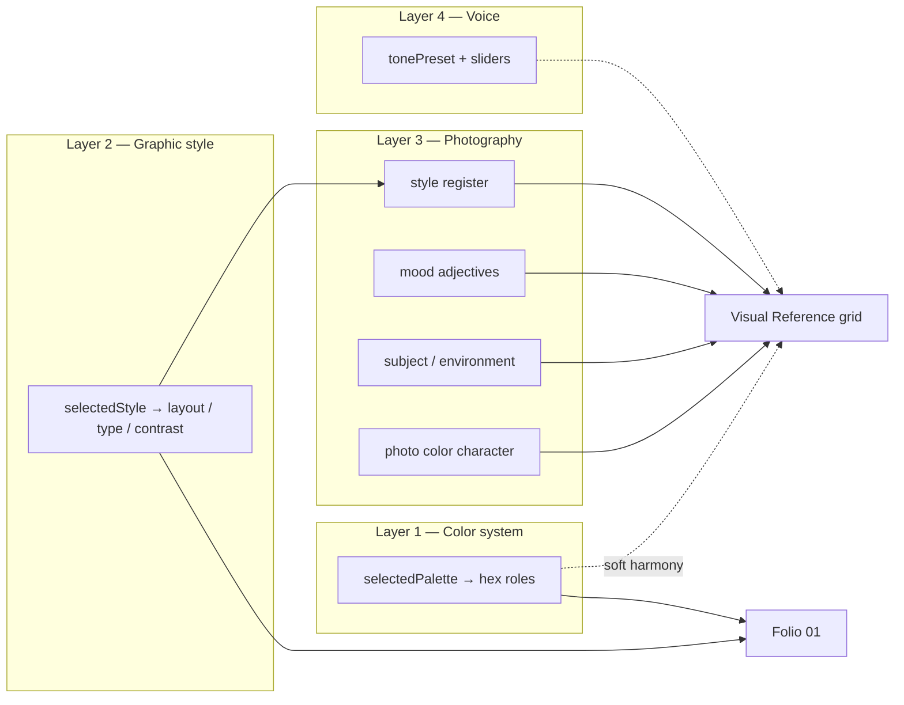

# Research: Moodboard signal model

**Status:** D1–D9 **signed off** (§9.1) — bulk sourcing blocked until R5 spec/code alignment  
**Date:** 2026-05-30  
**Authors:** Product / Pro-G groundwork  
**Related:** [`MOODBOARD_BANK_TAG_TAXONOMY.md`](./MOODBOARD_BANK_TAG_TAXONOMY.md) (vocabulary — weights under review), [`MOODBOARD_BANK_CURATION.md`](./MOODBOARD_BANK_CURATION.md), [`PRO_KIT_STRATEGY.md`](../audits/PRO_KIT_STRATEGY.md) §7.3.4, [`OUTPUT_TRANSLATION_SPEC.md`](../../OUTPUT_TRANSLATION_SPEC.md) §5.8

---

## 1. Executive summary

The Pro Visual Reference Spread (Style Guide folios 06–07) is a **photography and visual-world handoff**, not a second palette page. Folio 01 owns hex swatches and color roles; the spread answers: *what should photos feel like — light, subject, composition, texture, emotional register?*

Early Pro-G docs organized the image bank and matcher around **`paletteFamily` as a primary tag** (40% of deterministic score; 48-cell coverage matrix = 8 palette families × 6 scene types). That made operational sense for sourcing 240 images, but it **conflates two different branding layers**:

| Layer | Question it answers | Kit intake today |
|-------|-------------------|------------------|
| **Color system** | What colors go on logo, UI, packaging, swatches? | `selectedPalette` |
| **Graphic / layout style** | How does the identity behave in type, layout, contrast? | `selectedStyle` |
| **Photography direction** | What should camera-facing work look like? | *Partially* `selectedStyle`, `moodAdjectives`, `visualNotes` |
| **Voice / tone** | How does the brand speak? | `tonePreset`, sliders, voice samples |

**Hypothesis (to validate in this research):** Photography direction should be ranked primarily by **style register + mood adjectives + subject/environment**, with **palette as a soft harmony hint** — not the dominant filter. Several intentional, good brand systems **require** palette and photo hue to diverge (warm brown café identity + green nature photography; colorful mark + monochrome brutalist photos).

**Recommendation until decided:** Pause bulk sourcing. Revise signal weights and possibly bank organization axis before ingesting 240+ images.

---

## 2. Job of the Visual Reference spread

### 2.1 What a designer or photographer should take away

After reading folio 01 (colors) + folios 06–07 (references), a collaborator should know:

1. **Color application** — from folio 01 (roles, swatches, usage discipline)
2. **Photographic register** — light quality, contrast, grain, staging, backdrop behavior
3. **Subject vocabulary** — what appears in frame (interiors, hands, nature, product, people-at-work)
4. **Emotional temperature** — calm vs energetic, premium vs accessible
5. **Permitted tension** — when photos may *not* echo brand hexes (caption should say so explicitly)

### 2.2 What the spread is not

- Not a mandate that every photo’s dominant hue matches the named palette
- Not AI-generated imagery
- Not a replacement for Camentra / photography technique guidance (post-purchase trial handles how-to)

### 2.3 Product promise alignment

From [`DELIVERABLE_PRODUCTION_SPEC.md`](../../DELIVERABLE_PRODUCTION_SPEC.md) §2:

> *Palette: informs ranker/caption as an input signal only on this spread — full swatch rules remain on folio 01.*

That wording already implies **palette ≠ photo selection primary key**. Current matcher implementation does not reflect that intent.

---

## 3. Four-layer brand model



**Key insight:** Layers 1 and 3 are **orthogonal by design** in many strong brands. Matching them is one valid strategy (`echo-brand-colors`); it is not the default for every kit.

---

## 4. Current architecture audit

### 4.1 Deterministic matcher (implemented stub)

| Signal | Weight | Kit source |
|--------|--------|------------|
| `paletteFamily` | **40** | `paletteFamilyFromPaletteId(selectedPalette)` |
| `styleRegister` | 25 | `selectedStyle` → primary + secondary |
| `moodAdjectives` | 15 | `step6.moodAdjectives[]` |
| `industrySuitability` | 8 | `step1.industry` |
| `narratorAlignment` | 7 | `step1.brandNarrator` |
| `referenceImageTags` | 5 | Fulfillment vision (existing-brand) |

**Broadening order** ([`PRO_KIT_STRATEGY.md`](../audits/PRO_KIT_STRATEGY.md) §7.3.4): drop style register → mood → scene weighting. **Palette is never dropped.**

### 4.2 Bank organization

- Required primary tag on every asset: `paletteFamily`, `styleRegister`, `sceneType`
- Coverage floor: **8 × 6 × 5 = 240** images keyed on palette × scene

### 4.3 Rich signals not wired to moodboard

| Signal | Where it lives | Used for moodboard? |
|--------|----------------|---------------------|
| `STYLE_IMAGERY_CORE[selectedStyle]` | `phase8Content.ts` | No — prose only |
| `CLUSTER_IMAGERY_TAIL[touchpointCluster]` | `phase8Content.ts` | No |
| `visualNotes` | Step 6 optional | No |
| `tonePreset` + sliders | Step 3 | No |
| `touchpoints` / operating model | Step 1 | No (cluster derived but unused) |
| Imagery direction AI rewrite | Pro Style Guide | No |

The kit **already writes** better photographic guidance than the matcher uses.

---

## 5. Brand case studies

Each case: identity layers, **correct** photographic world, what **today’s model** would push toward, and **research verdict**.

### 5.1 Warm café + green nature photography (user example)

**Identity:** Harbor Row Coffee — fixture [`coffee-founder.json`](../../packages/generation/src/fixtures/personas/coffee-founder.json)

| Layer | Value |
|-------|-------|
| Palette | `earthy_warmth` → bank **`warm-earth`** |
| Style | `organic_natural` → register **`warm`** (+ raw, refined) |
| Industry | `food_beverage` → **`hospitality_food`** |
| Narrator | `solo_maker` |
| Mood chips | *(not in fixture — Pro would likely pick warm, organic, calm)* |

**Correct photo direction:** Interior warmth in some shots, but also **outdoor greenery, farmers-market beans, hands on pour-over** — full natural color including greens. Logo/signage/UI stay tan/brown.

**Today’s model:** Heavy `warm-earth` filter → brown-toned textures, amber light, terracotta surfaces. **Under-represents green/nature** even though `organic_natural` imagery prose explicitly wants natural texture and earthy light, not brown monochrome.

**Verdict:** Palette-heavy matching **fails** a coherent brand. Style + mood + subject should dominate; caption should bridge: *“UI stays warm earth; references lean living/organic environments.”*

---

### 5.2 Colorful logo + minimal identity + brutalist B&W photos (user example)

**Hypothetical kit:**

| Layer | Value |
|-------|-------|
| Palette | `candy_burst` or `signal_orange` → **`bold-saturated`** |
| Style | `clean_minimal` → register **`refined`** / austere |
| Mood | `austere`, `sharp`, `geometric` |
| Photo intent | **Neutral mono**, high contrast, architectural — color lives in logo/UI only |

**Today’s model:** `bold-saturated` primary filter → vivid color-block stock. **Conflicts** with minimal/brutalist photo intent.

**Verdict:** Need **`photoColorRelationship: neutral-backdrops`** (or equivalent) intake signal. Palette should be **tie-break only**; style register `austere`/`sharp` must win.

---

### 5.3 Established B2B expert — restrained identity, neutral photography

**Fixture:** [`established-pro.json`](../../packages/generation/src/fixtures/personas/established-pro.json) — Sterling Compliance Advisors

| Layer | Value |
|-------|-------|
| Palette | `minimal_light` → **`cool-minimal`** |
| Style | `luxe_refined` → **`refined`** / austere |
| Industry | consulting → **`professional_services`** |
| Touchpoints | LinkedIn only |

**Correct photos:** Controlled offices, documents, restrained portraits, **desaturated** environments — aligns reasonably with `cool-minimal` + `refined`.

**Today’s model:** Works **by accident** — palette and photography align.

**Verdict:** Palette-heavy model works when layers coincide; **must not assume they always do.**

---

### 5.4 Neo-brutalist consumer app (hypothetical)

| Layer | Value |
|-------|-------|
| Palette | `neo_utility` / `cyber_lime` → **`bold-saturated`** |
| Style | `bold_graphic` → **`sharp`** / playful |
| Mood | `energetic`, `futuristic`, `sharp` |

**Correct photos:** Flash photography, hard flash, street, product on solid backgrounds — may be **high saturation** OR **high contrast B&W with neon accent in frame** (not in palette swatches).

**Verdict:** Style + mood reliable; palette family alone too coarse (groups neon + earth + pop).

---

### 5.5 Wellness studio — soft identity, airy interiors

| Layer | Value |
|-------|-------|
| Palette | `sea_glass` / `moss_meadow` → **`soft-organic`** or **`bright-fresh`** |
| Style | `organic_natural` |
| Industry | `health_wellness` |
| Mood | `calm`, `soft`, `organic` |

**Correct photos:** Bright mats, plants, linen, soft window light — **green and cream** common.

**Today’s model:** Moderate fit if `soft-organic` bucket is interpreted broadly.

**Verdict:** Subject tags (`interiors`, `wellness context`) help more than palette hue.

---

### 5.6 Luxury fashion editorial — dark palette, high-contrast photos

| Layer | Value |
|-------|-------|
| Palette | `midnight_luxe` → **`deep-moody`** |
| Style | `luxe_refined` |
| Mood | `premium`, `austere`, `refined` |

**Correct photos:** Low-key lighting, B&W or desaturated — **matches deep-moody**.

**Verdict:** Another case where layers align; reinforces that palette family is a **proxy for photo grading** when brands want moody/dark — not for “match hexes.”

---

### 5.7 Community nonprofit — warm brand, diverse documentary photography

**Fixture:** [`community-org.json`](../../packages/generation/src/fixtures/personas/community-org.json) (if present — use general pattern)

**Correct photos:** People in context, community spaces, authentic documentary color — **full spectrum**, not one palette family.

**Verdict:** Industry + narrator + mood > palette; **`natural-full-color`** relationship likely default.

---

### 5.8 Existing brand with reference upload

**When `referenceImageRef` is present** ([`OUTPUT_TRANSLATION_SPEC.md`](../../OUTPUT_TRANSLATION_SPEC.md) §5.8.6):

- Step 0 emits a structured **`referenceVisionProfile`** (not a flat tag list) — see §9.1 D6
- Profile drives shortlist composition at **strong weight** (target 25–35% of matcher influence when present)
- Ranker treats reference as **primary photographic alignment target**, not tie-break only
- **`logoRef` vision is separate** — color-system layer only; never filters the photo bank

---

## 6. Signal inventory — full stack

### 6.1 Available today (intake + derived)

| Signal | Step / source | Semantic layer | Moodboard use today | Proposed tier |
|--------|---------------|----------------|---------------------|---------------|
| `selectedPalette` | Step 6 | Color system | → paletteFamily (40%) | **C** — soft / caption |
| `selectedStyle` | Step 6 | Graphic + photo | → styleRegister (25%) | **B** — primary |
| `moodAdjectives[]` | Step 6 Pro | Photography mood | 15% | **B** — primary |
| `visualNotes` | Step 6 | Photography freeform | unused | **B** — ranker prompt |
| `industry` | Step 1 | Subject context | 8% | **C** |
| `brandNarrator` | Step 1 | Business posture | 7% | **C** |
| `tonePreset` + sliders | Step 3 | Voice | unused | **C** — ranker |
| `touchpointCluster` | derived | Channel / environment emphasis | unused | **B** — ranker |
| `STYLE_IMAGERY_CORE` | derived | Photography prose | unused | **B** — ranker |
| `referenceImage` | Step 6 | Photography ground truth | 5% + ranker vision | **A** when present |
| `logoExtractedColors` | Step 6 | Color system | unused | **D** — not photo filter |
| Scene type / orientation | bank metadata | Layout constraint | hard | **A** — hard |

### 6.2 Missing — candidate intake additions

| Proposed field | Type | Resolves |
|----------------|------|----------|
| **`photoColorRelationship`** | enum (3) | Palette vs photo hue divergence |
| **`imagerySubjects[]`** | chips (6–8) | Nature vs studio vs urban vs product… |
| **`photographyStyleOverride`** | optional enum | When photo style ≠ graphic style |
| *(stretch)* **`referenceMoodUrl`** | optional upload Core+Pro | Reference without full existing-brand track |

#### `photoColorRelationship` (draft enum)

| Value | Meaning |
|-------|---------|
| `echo-brand-colors` | Photos should harmonize with palette hues (warm brand → warm photos) |
| `neutral-backdrops` | Photos mostly neutral/mono; brand color in UI/logo only |
| `natural-full-color` | Full natural color in photos even when different from swatches |

**Default when omitted:** Derive from `selectedStyle` — e.g. `clean_minimal` → lean `neutral-backdrops`; `organic_natural` → lean `natural-full-color`; else `echo-brand-colors` as soft default.

#### `imagerySubjects[]` (signed — see §9.1 D5)

Pick **2–4** at Pro Step 6 from the **10-chip v1 set** (§9.1). Maps to bank secondary tags and ranker; reduces reliance on palette family for subject matter.

**Not the same as `sceneType`:** scene type drives grid *variety* (texture vs people vs environment). Subject chips drive *what world the brand lives in* (café vs forest vs studio).

---

## 7. Weighting models — compare

### 7.1 Model A — Current (implemented)

```
palette 40 > style 25 > mood 15 > industry 8 > narrator 7 > reference 5
Broaden: style → mood → scene (palette sticky)
```

**Fails:** §5.1, §5.2, §5.7 when layers diverge.

### 7.2 Model B — Photography-first (recommended baseline)

```
style 32 > mood 28 > subjects 20 > industry 8 > narrator 7 > palette 5 > reference 5*
Broaden: palette → industry → relax mood → style last
* reference 25+ when upload present — may bypass matcher top-N via vision shortlist boost
```

### 7.3 Model C — Ranker-heavy (minimal matcher)

Matcher only filters: orientation, scene-type pool, industry extreme mismatches. **Top 40** passed to Haiku with full prose bundle (`STYLE_IMAGERY_CORE`, cluster tail, visualNotes, all intake). Matcher weights matter less.

**Tradeoff:** Higher AI cost, better holistic judgment; needs strong prompt + walker.

### 7.4 Research recommendation

- **Short term:** Model B + wire prose into ranker (no new intake required)
- **Before sourcing:** Add `photoColorRelationship` + `imagerySubjects` (Model B+)
- **Evaluate:** Model C on 8 fixtures after Pro-A plumbing

---

## 8. Taxonomy / bank organization options

| Option | Bank primary axes | Pros | Cons |
|--------|-------------------|------|------|
| **Keep** palette × scene (48 cells) | Operational grid exists | Simple sourcing spreadsheet | Encodes wrong semantic priority |
| **Pivot** style × scene (36 cells) | Matches photo register | Aligns with matcher | 6×6 still coarse |
| **Split** photo color character + harmony | Expressive + flexible | Handles §5.1, §5.2 | More curator training |
| **Dual matrix** | Coverage on style×scene; palette as secondary tag only | Best of both | Re-tag if we sourced by palette |

**Research recommendation:** Keep **`sceneType`** as required (layout variety). Demote **`paletteFamily`** to secondary or rename to **`photoColorCharacter`**. Organize sourcing coverage on **`styleRegister × sceneType`** (36 × 5 = 180 min) plus scene-weight targets (texture 30%, etc.).

---

## 9. Decisions required (sign-off checklist)

| # | Decision | Options | Blocks |
|---|----------|---------|--------|
| D1 | Is palette primary or soft for matching? | Primary / soft / caption-only | Matcher weights, taxonomy doc |
| D2 | Bank coverage matrix axis | palette×scene / style×scene / hybrid | Sourcing plan |
| D3 | Rename or split palette tag | keep / `photoColorCharacter` + `brandHarmony` | Bank metadata schema |
| D4 | Add `photoColorRelationship` intake? | yes / derive-only / defer | Step 6 UI |
| D5 | Add `imagerySubjects[]` intake? | yes / infer from industry / defer | Step 6 UI |
| D6 | Reference image overrides palette? | yes when present / no | §5.8.4 contract |
| D7 | Caption may affirm palette–photo tension? | required when diverge / always optional | Caption prompt |
| D8 | Broadening order | palette first vs style last | §5.8.6 |
| D9 | Default moodboard when mood chips empty | style+prose / palette fallback / generic texture | Failure paths |

### 9.1 Signed decisions (2026-05-30)

Product sign-off with refinements on D5 (expanded chip set) and D6 (reference override scope + AI prompt contract).

| # | Decision | Signed answer |
|---|----------|---------------|
| **D1** | Palette primary or soft? | **Soft (~5–10% matcher)** — caption context only for harmony; folio 01 owns color |
| **D2** | Coverage matrix axis | **`styleRegister × sceneType`** (36 cells × 5 min ≈ 180 floor); track **portrait/landscape counts per cell** for layout slots |
| **D3** | Palette tag | **v1:** reframe `paletteFamily` as **photo color character** in docs; **v2:** `prominentHueFamilies[]` on bank assets + optional `brandHarmony[]` |
| **D4** | `photoColorRelationship` intake | **Yes** — 3-value enum; default from `selectedStyle` when omitted |
| **D5** | `imagerySubjects[]` intake | **No intake** — infer from reference vision + industry/style; bank tags for curators only (§5.8.5) |
| **D6** | Reference override scope | **Structured vision profile overrides photographic signals** — not palette-only; see §9.1.2 |
| **D7** | Caption palette–photo tension | **Required** when `photoColorRelationship` is `neutral-backdrops` or `natural-full-color` |
| **D8** | Broadening order | **Palette → industry → subjects → mood → style** (orientation + scene variety never dropped) |
| **D9** | Empty mood chips | **`selectedStyle` + `STYLE_IMAGERY_CORE` + cluster tail**; last resort texture/pattern — **never palette-heavy fallback** |

#### 9.1.1 D5 — `imagerySubjects` (revised — no intake)

**Signed:** Do **not** ask buyers what appears in frame. That is fulfillment work:

| Source | Role |
|--------|------|
| Reference vision profile | Primary when reference uploaded |
| Industry + style heuristics | Soft matcher hints when no reference |
| Ranker + `visualNotes` + imagery prose | Holistic subject judgment |

The **10-value vocabulary** (below) tags bank assets and extractor output only — same list as before, removed from Step 6 UI.

| Chip ID | Buyer-facing label | When to pick | Case study |
|---------|-------------------|--------------|------------|
| `nature-outdoors` | Nature & outdoors | Parks, farms, landscapes, plants in context | §5.1 café + green |
| `interiors-spaces` | Interiors & spaces | Rooms, venues, workspaces, storefronts | §5.3 B2B office |
| `studio-neutral` | Studio & neutral setups | Controlled backdrop, styled still life | §5.2 brutalist product |
| `urban-context` | Urban & street life | City streets, signage context, transit energy | §5.4 neo-brutalist |
| `architecture-built` | Architecture & structure | Facades, structural lines, built form | §5.2 B&W architectural |
| `food-dining` | Food & dining | Table, kitchen, beverage, hospitality moments | §5.1 Harbor Row |
| `hands-process` | Hands & craft process | Making, pouring, tools — no hero faces | §5.1 pour-over |
| `product-still-life` | Product & still life | Packaged goods, objects, merch | §5.4 consumer app |
| `people-community` | People & community | Groups, candid presence — bank still **no identifiable faces** | §5.5 wellness |
| `materials-texture` | Materials & texture | Linen, stone, paper, macro tactility | Bank `texture` scene bias |

**Explored but not in v1 intake** (bank-only or infer from vision — avoids chip overload)

| Candidate | Why deferred |
|-----------|--------------|
| `water-coast` | Niche; often covered by `nature-outdoors` + wellness industry |
| `macro-detail` | Merged into `materials-texture` for buyers |
| `technology-modern` | Too close to `interiors-spaces` + `b2b_tech` industry tag |
| `events-gatherings` | Overlaps `people-community`; hard to source ethically |
| `travel-movement` | Lifestyle-specific; infer from `visualNotes` + ranker |

**Rename note:** Draft `abstract-texture` → **`materials-texture`** — clearer for non-marketers.

#### 9.1.2 D6 — Reference vision override contract

Reference upload is **photography ground truth** (Layer 3). Logo upload is **color-system ground truth** (Layer 1). Do not conflate them in the pipeline.

**Step 0 upgrade:** Replace flat `referenceImageTags: string[]` with **`referenceVisionProfile`**:

| Profile field | Maps to | Override vs kit intake |
|---------------|---------|------------------------|
| `photoColorCharacter` | bank `paletteFamily` (reframed) | **Reference wins** over kit-derived photo color for matcher |
| `photoColorRelationship` | intake enum (inferred) | **Reference wins** unless buyer explicitly set D4 |
| `styleRegisters[]` | bank `styleRegister` | **Reference wins for photo matching** when diverges from graphic `selectedStyle`; graphic style unchanged for copy/type |
| `imagerySubjects[]` | bank + inference | **Reference adds**; industry/style heuristics when no reference |
| `sceneTypes[]` | bank `sceneType` | **Ranker bias only** — shapes variety toward reference mix; hard scene cap unchanged |
| `moodAdjectives[]` | bank mood tags | **Fill when mood chips empty**; when chips set, reference is **tie-break only** (explicit intake wins) |
| `compositionNotes` | ranker prompt only | Free text ≤120 chars — light, staging, contrast read |

**What reference does NOT override**

| Signal | Reason |
|--------|--------|
| Explicit `moodAdjectives[]` chips | Buyer deliberate — already in spec |
| `industry`, `brandNarrator` | Business facts, not photographic taste |
| `selectedStyle` for Layer 2 surfaces | Copy, typography, layout prose — graphic identity stands |
| `logoExtractedColors`, `hexColors` | Color system for folio 01 — may *suggest* D4 default only |
| Layout hard constraints | Orientation per slot, ≤3 per scene type |

**Matcher weight target when profile present (Model B+):**

```
style (from profile) 28 > subjects 22 > mood 20 > reference scene bias 10 >
industry 8 > narrator 7 > kit palette 5
(profile photoColorCharacter replaces kit paletteFamily for the 5% slot when they conflict)
```

**Ranker prompt (R5 — replaces §5.8.4 “tie-break only” language):**

> *You are selecting from a fixed bank — you cannot pick images outside the provided shortlist. The buyer uploaded a **reference image** as their stated photographic intent. **Prioritize** shortlist images that match the reference's register, color character, subjects, and light quality. When the reference diverges from the kit palette swatches, **follow the reference for photography**; palette harmony is secondary. Explicit mood adjective chips outrank reference mood tags when they conflict. Assign each pick to a layout slot; orientation must match the slot.*

**Reference tag extractor prompt (R5 — new structured output):**

> *Analyze this reference image as **photographic direction only** — not logo or UI color rules. Return bank-vocabulary tags only. Infer how photos should behave for this brand: color character in the **photograph itself**, style register, dominant scene types, mood adjectives, imagery subjects (§9.1.1), and photoColorRelationship. If the photo world would diverge from warm/cool brand swatches, say so in compositionNotes. Do not infer industry or business type from the image alone.*

**Logo analysis boundary:** Brand Audit may observe logo colors; moodboard pipeline **must not** filter bank images by `logoExtractedColors`. Optional: when reference absent but logo present, use logo only to default D4 toward `echo-brand-colors` — never to narrow photo hue.

#### 9.1.3 Orientation (confirmed — not a D-item)

`orientation: portrait | landscape` remains a **Tier A hard constraint** on every bank asset (auto at ingest), enforced at ranker slot assignment. Not kit intake. Sourcing QA: count orientations per style×scene cell so portrait slots can fill.

---

## 10. Research activities (next steps)

### Phase R1 — Desk research (this doc)

- [x] Four-layer model + case studies
- [x] Current vs proposed weights
- [x] D1–D9 sign-off (§9.1)
- [ ] **Your review:** mark case studies agree/disagree; add 2 real brands you admire

### Phase R2 — External reference brands (2–3 hours)

Document 8–10 real businesses across:

- Food/hospitality (coffee, restaurant)
- B2B professional
- DTC product
- Creative studio
- Wellness

For each capture: website screenshot notes, **palette vs photo hue relationship**, photographic register, whether identity would pass a “palette-primary” automated picker.

Deliverable: appendix table in this doc or `MOODBOARD_BRAND_BENCHMARKS.md`.

### Phase R3 — Fixture scoring workshop

Run 8 persona fixtures ([`packages/generation/src/fixtures/personas/`](../../packages/generation/src/fixtures/personas/)) through:

1. Manual “ideal photo world” description (1 paragraph)
2. Model A shortlist characteristics (palette-heavy)
3. Model B shortlist characteristics (photography-first)
4. Pass/fail vs manual

Deliverable: scorecard table; informs D1–D9.

### Phase R4 — Intake UX sketch

- Wireframe Step 6 additions: `photoColorRelationship` + `imagerySubjects`
- Copy test: do non-marketers understand “neutral-backdrops” vs “natural-full-color”?

### Phase R5 — Spec revision

- [x] [`MOODBOARD_BANK_TAG_TAXONOMY.md`](./MOODBOARD_BANK_TAG_TAXONOMY.md) — subjects, photo color character, style×scene axis
- [x] [`OUTPUT_TRANSLATION_SPEC.md`](../../OUTPUT_TRANSLATION_SPEC.md) §5.8 — pipeline, Model B weights, reference vision, intake vocab
- [x] [`AI_INTEGRATION_PLAYBOOK.md`](./AI_INTEGRATION_PLAYBOOK.md) §12.9.6 — ranker/caption/extractor prompts
- [x] Shared schemas — `ReferenceVisionProfileSchema`, `imagerySubjects`, `photoColorRelationship`; `kitSignals` + Model B `tagMatcher`
- [x] Step 6 UI — `photoColorRelationship` only (subjects inferred, not asked)
- [x] Fulfillment wiring — extractor + ranker + caption section modules; pipeline shortlist + deterministic fallback
- [x] `coverageMatrix.ts` — pivot reporting to style×scene axis

---

## 11. Fixture scorecard (draft — qualitative)

| Fixture | Palette family | Style register | Photo world (ideal) | Model A risk | Model B fit |
|---------|----------------|----------------|---------------------|--------------|-------------|
| `coffee-founder` | warm-earth | warm | Mixed café + green/nature | High — brown wash | Good |
| `established-pro` | cool-minimal | refined | Neutral corporate | Low | Good |
| `lean-core` (photo) | varies | organic/refined | Portraits, golden hour | Medium | Good |
| `pc05-regulated-legal` | cool/deep | refined | Office, neutral | Low | Good |
| `pc08-social-product` | bold/pop | sharp/playful | Product, saturated | Medium | Good |
| Hypothetical brutalist | bold-saturated | austere/sharp | B&W architectural | **High** | Good w/ `neutral-backdrops` |
| Hypothetical nature café | warm-earth | warm | Green/nature heavy | **High** | Good w/ `natural-full-color` |

---

## 12. Open questions for discussion

1. Should **`selectedStyle`** officially mean both graphic design and photography, or do we split later?
2. Is **`paletteFamily`** on bank images “dominant photo hue” or “kits this photo complements”?
3. Can **`moodAdjectives`** absorb subject hints (`organic` → nature) or do we need separate **`imagerySubjects`**?
4. Should Core Pro-less kits get a thinner spread (style + industry only) or same bank?
5. How explicitly should the caption **name** palette–photo tension vs leave implicit?

---

## 13. References in repo

| Artifact | Path |
|----------|------|
| Imagery prose per style | `packages/generation/src/deterministic/phase8Content.ts` |
| Kit signal resolver | `packages/shared/src/imageBank/kitSignals.ts` |
| Matcher weights | `packages/generation/src/image-bank/tagMatcher.ts` |
| Step 6 UI | `apps/web/src/components/steps/Step6Aesthetic.tsx` |
| Visual Reference PDF | `packages/generation/src/pdf/VisualReferenceSpread.tsx` |

---

## Changelog

| Date | Change |
|------|--------|
| 2026-05-30 | Initial research memo — palette-as-primary challenged; Model B proposed |
| 2026-05-30 | §9.1 signed — D5 expanded to 10 chips; D6 reference vision profile + prompt contract |
| 2026-05-30 | R5 spec pass — OUTPUT_TRANSLATION_SPEC §5.8, playbook §12.9.6, shared schemas, Model B matcher |
| 2026-05-30 | Pro-G plumbing — Step 6 intake UI, visual reference pipeline, moodboard AI section modules |
