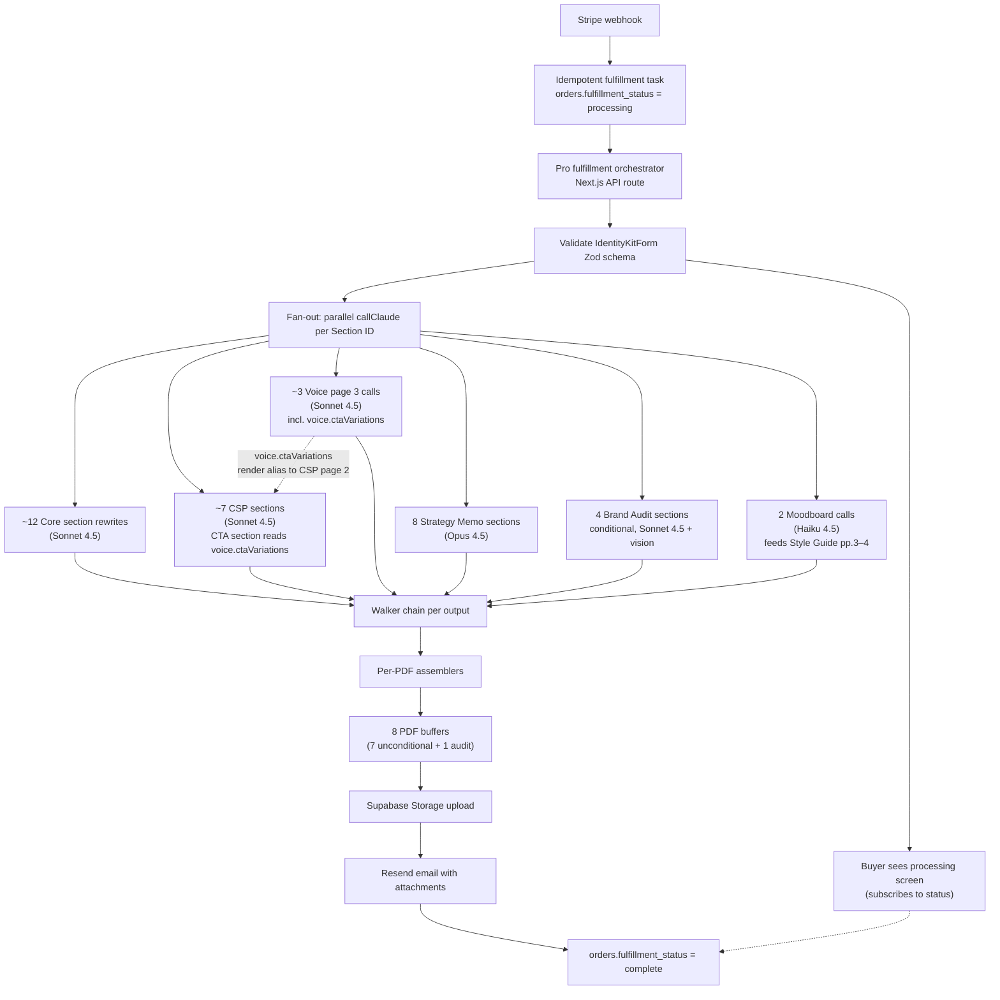

# Research: Pro fulfillment orchestration (per-kit contract)

**Status:** Sprint-prep for Pro-A. Specifies how the ~25 per-call AI invocations in [`AI_INTEGRATION_PLAYBOOK.md`](./AI_INTEGRATION_PLAYBOOK.md) assemble into a complete Pro kit fulfillment lifecycle. The playbook owns the **per-call** contract; this doc owns the **per-kit** contract.

**Related:**

- [`AI_INTEGRATION_PLAYBOOK.md`](./AI_INTEGRATION_PLAYBOOK.md) — per-call adapter, prompts, walkers.
- [`PRO_KIT_STRATEGY.md`](../audits/PRO_KIT_STRATEGY.md) §10 risks, §11 Pro-A phase scope.
- [`OUTPUT_TRANSLATION_SPEC.md`](../../OUTPUT_TRANSLATION_SPEC.md) §1.2 Mode Matrix (Section ID registry), §5.6–§5.8.
- [`DELIVERABLE_PRODUCTION_SPEC.md`](../../DELIVERABLE_PRODUCTION_SPEC.md) §6–§8 per-PDF specs.
- [`PRODUCT.md`](../../PRODUCT.md) Pro fulfillment policy section.
- [`OPERATIONS.md`](../../OPERATIONS.md) §8 "Fulfillment pipeline" — Pro plugs in here.

---

## §1 Executive summary

Pro kit fulfillment starts at the Stripe webhook. The webhook handler creates an idempotent fulfillment task and hands off to the **Pro orchestrator** (a Next.js API route in `apps/web` calling the AI module in `packages/generation`). The orchestrator validates the `IdentityKitForm` against the canonical Zod schema and surfaces a "processing" status row to the buyer-facing order page within seconds.

The orchestrator then fans out the ~25 per-call AI invocations — roughly 12 Core rewrites + 7 CSP sections + 3 Voice page 3 calls (one of which, `voice.ctaVariations`, is shared with the CSP page 2 CTA section per [`OUTPUT_TRANSLATION_SPEC.md`](../../OUTPUT_TRANSLATION_SPEC.md) §10A.6A.1) + 8 Strategy Memo sections + 4 Brand Audit sections (conditional) + 2 Moodboard calls (feeding the Pro Visual Reference Spread on Style Guide pages 3–4) — in parallel through the `callClaude` adapter, all sharing the cacheable system prompt per playbook §6.1. Each call flows through its walker chain (playbook §12.10), then through the per-PDF assembler (cardinality rules per [`DELIVERABLE_PRODUCTION_SPEC.md`](../../DELIVERABLE_PRODUCTION_SPEC.md) §2 / §6 / §7).

Per-call outputs feed per-PDF assemblers; per-PDF outputs feed Supabase Storage upload; the final delivery step is an email with PDF attachments via Resend. Failure modes degrade gracefully across four layers: **call** (playbook §7.4 dispatcher), **section** (playbook §12.9 catalog), **PDF** (this doc §5 ladder), and **kit** ([`PRODUCT.md`](../../PRODUCT.md) Pro fulfillment policy matrix).

---

## §2 Lifecycle diagram



---

## §3 Components

Five components own the per-kit lifecycle. Each has a clearly-scoped contract (inputs, outputs, failure-handling responsibility) and a layer in the §5 failure ladder.

### §3.1 Orchestrator

**Inputs:** `orderId`, `IdentityKitForm` (validated against the canonical Zod schema during entry).

**Outputs:** status row updates in `orders.fulfillment_status` plus `kit_fulfillment_events` rows; a final set of PDF buffers handed to Storage upload.

**Locked location:** Next.js API route in `apps/web` that calls the `packages/generation` AI module, with a Supabase `pg_boss` job queue used to enqueue the fan-out so the order-status page does not block on 90 seconds of AI calls. The webhook handler returns immediately after enqueueing; the orchestrator runs as a `pg_boss` worker in the same Next.js runtime.

**Owns kit-layer retry decisions.** When section results return permanent failures, the orchestrator decides whether to ship-degraded, swap a deterministic fallback, or escalate to a kit-layer failure per the §5 ladder. (No separate "retry coordinator" component — call-layer retries live in the playbook §7.4 dispatcher, section-layer retries live in the walker loop, kit-layer retries are orchestrator decision logic.)

### §3.2 Per-section worker

**Inputs:** Section ID, intake context, walker registry entry, call-class defaults from playbook §7.2.

**Outputs:**

```ts
{
  sectionId: string;
  output: unknown;        // typed per Section ID
  fieldsCited: string[];  // intake field names grounding the output
  durationMs: number;
  model: string;
  tokensIn: number;
  tokensOut: number;
  status: "ok" | "walker_failed" | "refused" | "skipped" | "fallback_shipped";
}
```

**Owns:** wrapping `callClaude` with call-class defaults; truncation retry (playbook §6.4); walker-loop retries (playbook §12.10). When all retries exhaust without a passing output, the worker either substitutes a deterministic scaffold (`status: "fallback_shipped"`) or returns a clean skip (`status: "skipped"`) per the playbook §12.9 catalog rules for that Section ID.

### §3.3 Walker chain

**Inputs:** raw model output, Section ID, walker registry.

**Outputs:** `{ pass: boolean, walker: string, reason?: string, retryHint?: object }`.

Runs the eight walkers from playbook §12.10 in order. First failure → one retry with adjusted parameters (`retryHint` describes what to change — e.g. `temperature - 0.1`, drop a noisy field) → fallback. The walker chain does not own retry policy beyond the single per-walker retry; kit-layer retry decisions belong to the orchestrator.

### §3.4 Per-PDF assembler

**Inputs:** the section-output set scoped to a single PDF, identified by Section ID.

**Outputs:** PDF buffer ready for Storage upload, OR a structured "PDF omitted" / "PDF replaced" decision back to the orchestrator.

**Owns:** minimum-cardinality enforcement per [`DELIVERABLE_PRODUCTION_SPEC.md`](../../DELIVERABLE_PRODUCTION_SPEC.md) §2 (Style Guide Pro Visual Reference Spread) / §6 (Strategy Memo) / §7 (Brand Audit):

- **Strategy Memo:** ≥ 6 of 8 sections valid → ships; ≤ 5 valid → assembler signals catastrophic failure and the orchestrator swaps in the deterministic Brand Identity Guide as a Memo replacement.
- **Brand Audit:** §1 valid (vision call passed walkers) AND ≥ 2 of §2/§3/§4 valid → ships; otherwise the entire Audit PDF is omitted.
- **Style Guide (Pro Visual Reference Spread, pages 3–4):** moodboard ranker passed (or deterministic top-6 fallback applied) AND caption present (AI or deterministic) → spread ships; otherwise the spread is omitted and the Style Guide ships at its 2-page Core length. The Style Guide itself always assembles — only the Pro spread is conditional on the moodboard pipeline.
- **Shared 5 PDFs (Core + Pro):** assemble unconditionally. Section-level `fallback_shipped` is allowed; the PDFs always render.
- **CSP (Pro):** all 7 sections optional individually but ≥ 6 of 7 must succeed for the PDF to ship. The CSP CTA section is rendered from `voice.ctaVariations` (a Voice page 3 call) per [`OUTPUT_TRANSLATION_SPEC.md`](../../OUTPUT_TRANSLATION_SPEC.md) §10A.6A.1 — it is not counted as one of the 7 CSP prompt calls but its output is required for the CSP CTA section to render variations; if it fails, the CSP CTA section ships the deterministic anchor CTA only and the surrounding CSP PDF still assembles. Below the 6-of-7 CSP-prompt threshold, ops are paged and the PDF is omitted with a buyer notification.

### §3.5 Status tracker

**Inputs:** events from the orchestrator, worker, and assembler layers.

**Outputs:** writes to `orders.fulfillment_status` (one row, latest state) and `kit_fulfillment_events` (append-only, full timeline).

**Owns:** the processing-screen subscription contract. The buyer-facing order page polls a derived view (`GET /api/orders/:orderId/fulfillment`) that aggregates the latest events into a high-level state, sections completed/total, PDFs assembled/total, and a current activity label.

---

## §4 Kit fulfillment state machine

States and transitions:

| From | To | Trigger | Event written |
|---|---|---|---|
| `pending` | `processing` | Orchestrator picks up job from `pg_boss` | `kit.processing_started` |
| `processing` | `assembling` | All workers complete (any status) | `kit.workers_complete` |
| `assembling` | `uploading` | All assemblers complete (any decision) | `kit.assembly_complete` |
| `uploading` | `delivering` | All PDF buffers uploaded to Storage | `kit.upload_complete` |
| `delivering` | `complete` | Email sent successfully via Resend | `kit.delivered` |
| `delivering` | `partial_delivered` | Email sent successfully but some PDFs were omitted/replaced | `kit.partial_delivered` |
| `processing` / `assembling` / `uploading` / `delivering` | `failed` | Any layer raises a catastrophic failure that the orchestrator does not recover | `kit.failed` |

The state machine is monotonic forward — there is no backward transition. A retry restarts a fresh job with the same `orderId` (idempotent on `orderId` so the worker no-ops if `fulfillment_status` is already `complete`).

---

## §5 Failure semantics across layers

The failure ladder maps cleanly to the components in §3. Each layer owns its own retry policy; layers do not retry on each other's behalf.

1. **Call layer** — playbook §7.4 dispatcher. Typed errors (`api_error`, `timeout`, `rate_limit`, `truncation`) → bounded retry with backoff → scaffold-and-refine → deterministic scaffold. Owner: `callClaude` adapter.
2. **Section layer** — when the call layer permanently fails (or returns a refusal), the worker decides between `status: "fallback_shipped"` (deterministic scaffold loaded) and `status: "skipped"` (optional section per playbook §12.9 catalog). Owner: per-section worker.
3. **PDF layer** — assembler checks the section result set against minimum cardinality. Ships, ships-degraded, or omits per the matrix in [`DELIVERABLE_PRODUCTION_SPEC.md`](../../DELIVERABLE_PRODUCTION_SPEC.md) §6–§8. Owner: per-PDF assembler.
4. **Kit layer** — final assembly checks the total PDF set against kit acceptance criteria. Full → full delivery. Degraded → partial delivery with buyer-side comms per [`PRODUCT.md`](../../PRODUCT.md) Pro fulfillment policy. Catastrophic → no delivery, ops paged, buyer gets the catastrophic-failure email. Owner: orchestrator.

Layer ownership summary: call = adapter; section = worker; PDF = assembler; kit = orchestrator.

---

## §6 Processing screen subscription contract

The buyer-facing processing screen (`/orders/:orderId/processing`) subscribes to fulfillment progress so the buyer sees activity within seconds and progress updates every few seconds. The processing screen never blocks on the full 90-second AI fan-out.

### §6.1 `kit_fulfillment_events` schema

```sql
create table kit_fulfillment_events (
  id uuid primary key default gen_random_uuid(),
  order_id uuid not null references orders(id) on delete cascade,
  ts timestamptz not null default now(),
  layer text not null check (layer in ('orchestrator','section','pdf','kit')),
  event text not null,
  section_id text,
  pdf_name text,
  status text,
  detail jsonb
);

create index kit_fulfillment_events_order_ts on kit_fulfillment_events(order_id, ts);
```

### §6.2 Polled aggregate view

```
GET /api/orders/:orderId/fulfillment
```

Returns:

```ts
{
  state: "pending" | "processing" | "assembling" | "uploading" | "delivering" | "complete" | "partial_delivered" | "failed";
  sectionsCompleted: number;
  sectionsTotal: number;
  pdfsAssembled: number;
  pdfsTotal: number;       // 8 unconditional + 1 conditional, expressed as 8 or 9
  currentActivity: string; // human-readable label, e.g. "Drafting your Brand Strategy Memo"
  startedAt: string;       // ISO timestamp
  estimatedCompleteAt: string | null; // null until first 5 sections complete
}
```

The processing screen polls every 3 seconds while `state ∈ {processing, assembling, uploading, delivering}`. SSE upgrade path noted; not v1 (polling is sufficient for a 90-second job and avoids the connection overhead).

---

## §7 Telemetry

Every event row in `kit_fulfillment_events` is also an analytics event (forwarded to whatever analytics destination the project uses; out of scope for v1 implementation but the row schema supports it).

The `ai_call_logs` table (defined in playbook §9) ties to `kit_fulfillment_events` by `order_id`. Operational dashboards aggregate two ways:

- **Per-kit timeline** — `kit_fulfillment_events` ordered by `ts` for one `order_id`, used for support investigations and processing-screen verification.
- **Cost accounting** — `ai_call_logs` summed by `order_id`, used for Pro margin tracking against the [`PRO_KIT_STRATEGY.md`](../audits/PRO_KIT_STRATEGY.md) §1.4 budget.

Operational alerts (page on-call, email ops) live in [`PRODUCT.md`](../../PRODUCT.md) Pro fulfillment policy "Ops alert thresholds." This doc owns the data; that doc owns the policy.

---

## §8 Where the orchestrator runs (decision lock)

**Decision:** Next.js API route in `apps/web` + Supabase `pg_boss` job queue.

This locks playbook §13 open decision 1. The orchestrator is a Next.js API route that the Stripe webhook hands off to via `pg_boss.send`. A worker process in the same Next.js runtime picks up the job and runs the fan-out. The order-status page polls a separate route that reads from `kit_fulfillment_events`.

**Alternatives considered and rejected for v1:**

- **Supabase Edge Function.** Rejected — Deno cold-start adds 1–2s on the first call after idle, which is visible to buyers, and the Edge Function platform's per-invocation memory caps are uncomfortable for the multi-PDF assembly step. Also splits orchestration code across runtimes (Next.js for the page, Edge for the worker), which the Pro-A team does not need.
- **Dedicated worker (Inngest / Trigger.dev / a long-running Node process).** Rejected — adds infra overhead disproportionate to v1 traffic (single-digit kits/day initially). Revisit when traffic exceeds the `pg_boss` single-node throughput (~50–100 jobs/min comfortable), expected mid-Pro phase at earliest.

---

## §9 Open decisions for Pro-A kickoff (not blockers)

These decisions have working defaults for v1 and can be revisited without unblocking Pro-A code work.

1. **Sync vs background fulfillment.** Recommendation per playbook §13 decision 2 stays: **background with optimistic processing screen**. The webhook handler enqueues and returns; the worker runs the fan-out; the buyer sees a processing screen that resolves to a delivery confirmation page when the job completes.
2. **Cache TTL.** Playbook §13 decision 6 stays: **ephemeral for v1**. The `cache_control` parameter on the system prompt uses Anthropic's default ephemeral TTL; revisit once we have data on cache hit rates and re-fulfillment frequency.
3. **`kit_fulfillment_events` retention.** Default: **90 days**. Revisit if ops investigations consistently need longer history; archive-to-cold-storage path is not required for v1.
4. **Per-kit timeout.** Recommend **120s soft + 300s hard**. Soft timeout → degraded-state notification on the processing screen ("This is taking longer than usual — we'll email you when it's ready"). Hard timeout → fail the kit, refund automatically, page ops (per [`PRODUCT.md`](../../PRODUCT.md) Pro fulfillment policy).
